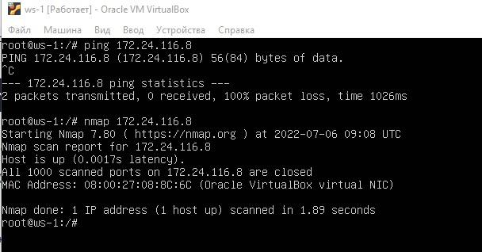
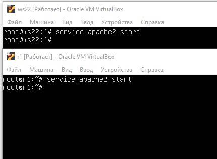

# Сети в Linux

Настройка сетей в Linux на виртуальных машинах.

## Contents

3.1. [Инструмент ipcalc](#part-1-инструмент-ipcalc) \
 3.2. [Статическая маршрутизация между двумя машинами](#part-2-статическая-маршрутизация-между-двумя-машинами) \
 3.3. [Утилита iperf3](#part-3-утилита-iperf3) \
 3.4. [Сетевой экран](#part-4-сетевой-экран) \
 3.5. [Статическая маршрутизация сети](#part-5-статическая-маршрутизация-сети) \
 3.6. [Динамическая настройка IP с помощью DHCP](#part-6-динамическая-настройка-ip-с-помощью-dhcp) \
 3.7. [NAT](#part-7-nat) \
 3.8. [Допополнительно. Знакомство с SSH Tunnels](#part-8-дополнительно-знакомство-с-ssh-tunnels)

## Part 1. Инструмент **ipcalc**

#### 1.1. Сети и маски

##### 1) Адрес сети _192.167.38.54/13_ - _192.160.0.0_

##### 2.1) Перевод маски _255.255.255.0_ в префиксную и двоичную запись

-   Префиксная запись: _/24_
-   Двоичная запись: _11111111.11111111.11111111.00000000_

##### 2.2) Перевод _/15_ в обычную и двоичную запись

-   Обычная запись: _255.254.0.0_
-   Двоичная запись: _11111111.11111110.00000000.00000000_

##### 2.3) Перевод _11111111.11111111.11111111.11110000_ в обычную и префиксную запись

-   Обычная запись: _255.255.255.240_
-   Префиксная запись: _/28_

##### 3.1) Минимальный и максимальный хост в сети _12.167.38.4_ при маскe: _/8_

-   HostMin: _12.0.0.1_
-   HostMax: _12.255.255.254_

##### 3.2) Минимальный и максимальный хост в сети _12.167.38.4_ при маскe: _11111111.11111111.00000000.00000000_

-   HostMin: _12.167.0.1_
-   HostMax: _12.167.255.254_

##### 3.3) Минимальный и максимальный хост в сети _12.167.38.4_ при маскe: _255.255.254.0_

-   HostMin: _12.167.38.1_
-   HostMax: _12.167.39.254_

##### 3.4) Минимальный и максимальный хост в сети _12.167.38.4_ при маскe: _/4_

-   HostMin: _0.0.0.1_
-   HostMax: _15.255.255.254_

#### 1.2. localhost

##### Определить и записать в отчёт, можно ли обратиться к приложению, работающему на localhost, со следующими IP: можно, где есть loopback

-   _194.34.23.100_ - нет
-   _127.0.0.2_ - да
-   _127.1.0.1_ - да
-   _128.0.0.1_ - нет

#### 1.3. Диапазоны и сегменты сетей

##### 1) какие из перечисленных IP можно использовать в качестве публичного, а какие только в качестве частных: _10.0.0.45_, _134.43.0.2_, _192.168.4.2_, _172.20.250.4_, _172.0.2.1_, _192.172.0.1_, _172.68.0.2_, _172.16.255.255_, _10.10.10.10_, _192.169.168.1_

-   Публичный) _134.43.0.2_, _172.0.2.1_, _192.172.0.1_, _172.68.0.2_, _192.169.168.1_
-   Частный) _10.0.0.45_, _192.168.4.2_, _172.20.250.4_, _172.16.255.255_, _10.10.10.10_  
    _У частных адресов в ipcalc "Private Internet"_

##### 2) какие из перечисленных IP адресов шлюза возможны у сети _10.10.0.0/18_: _10.0.0.1_, _10.10.0.2_, _10.10.10.10_, _10.10.100.1_, _10.10.1.255_

-   10.10.0.2, 10.10.10.10, 10.10.1.255

## Part 2. Статическая маршрутизация между двумя машинами

##### Поднять две виртуальные машины ws1 и ws2

##### С помощью команды `ip a` посмотреть существующие сетевые интерфейсы

##### Описать сетевой интерфейс, соответствующий внутренней сети, на обеих машинах и задать следующие адреса и маски: ws1 - _192.168.100.10_, маска _/16_, ws2 - _172.24.116.8_, маска _/12_

-   В отчёт поместить скрины с содержанием изменённого файла _etc/netplan/00-installer-config.yaml_ для каждой машины.
    
    

##### Выполнить команду `netplan apply` для перезапуска сервиса сети

-   В отчёт поместить скрин с вызовом и выводом использованной команды.
    
    

#### 2.1. Добавление статического маршрута вручную

##### Добавить статический маршрут от одной машины до другой и обратно при помощи команды вида `ip r add` и пропинговать соединение между машинами

#### 2.2. Добавление статического маршрута с сохранением

##### Перезапустить машины. Добавить статический маршрут от одной машины до другой с помощью файла _etc/netplan/00-installer-config.yaml_. Пропинговать соединение между машинами.

## Part 3. Утилита **iperf3**

#### 3.1. Скорость соединения

##### Перевести и записать в отчёт: 8 Mbps в MB/s, 100 MB/s в Kbps, 1 Gbps в Mbps

8 Mbps = 1MB/s, 100 MB/s = 100000Kbps, 1 Gbps = 1024Mbps

#### 3.2. Утилита **iperf3**

##### Измерить скорость соединения между ws1 и ws2

## Part 4. Сетевой экран

#### 4.1. Утилита **iptables**

##### Создать файл _/etc/firewall.sh_, имитирующий фаерволл, на ws1 и ws2:

##### Нужно добавить в файл подряд следующие правила:

1. на ws1 применить стратегию когда в начале пишется запрещающее правило, а в конце пишется разрешающее правило (это касается пунктов 4 и 5)
2. на ws2 применить стратегию когда в начале пишется разрешающее правило, а в конце пишется запрещающее правило (это касается пунктов 4 и 5)
3. открыть на машинах доступ для порта 22 (ssh) и порта 80 (http)
4. запретить _echo reply_ (машина не должна "пинговаться”, т.е. должна быть блокировка на OUTPUT)
5. разрешить _echo reply_ (машина должна "пинговаться")

-   В отчёт поместить скрины с содержанием файла _/etc/firewall_ для каждой машины.  
    
    

##### Запустить файлы на обеих машинах командами `chmod +x /etc/firewall.sh` и `/etc/firewall.sh`

-   Описать разницу между стратегиями, применёнными в первом и втором файлах:  
    Правила выполняются сверху вниз. Когда запрет находиться выше чем разрешение, срабатывает запрет, машины не пингуются.

#### 4.2. Утилита **nmap**

##### Командой **ping** найти машину, которая не "пингуется", после чего утилитой **nmap** показать, что хост машины запущен _Проверка: в выводе nmap должно быть сказано: `Host is up`_

## Part 5. Статическая маршрутизация сети

#### 5.1. Настройка адресов машин

##### Настроить конфигурации машин в _etc/netplan/00-installer-config.yaml_ согласно сети на рисунке.

##### Перезапустить сервис сети. Если ошибок нет, то командой `ip -4 a` проверить, что адрес машины задан верно. Также пропинговать ws22 с ws21. Аналогично пропинговать r1 с ws11.

-   файлы etc/netplan/00-installer-config.yaml для каждой машины:  
    
    
    
    
    

-   `ip -4 a`:  
    
    
    
    
    

-   Пропинговать ws22 с ws21.  
    
-   Пропинговать r1 с ws11.  
    

#### 5.2. Включение переадресации IP-адресов.

##### Для включения переадресации IP, выполните команду на роутерах:

##### Откройте файл _/etc/sysctl.conf_ и добавьте в него следующую строку: `net.ipv4.ip_forward = 1`

#### 5.3. Установка маршрута по-умолчанию

##### Настроить маршрут по-умолчанию (шлюз) для рабочих станций. Для этого добавить gateway4 \[ip роутера\] в файле конфигураций

-   В отчёт поместить скрин с содержанием файла _etc/netplan/00-installer-config.yaml_.  
    
    
    
    
    

##### Вызвать `ip r` и показать, что добавился маршрут в таблицу маршрутизации

##### Пропинговать с ws11 роутер r2 и показать на r2, что пинг доходит. Для этого использовать команду: `tcpdump -tn -i eth1`

#### 5.4. Добавление статических маршрутов

##### Добавить в роутеры r1 и r2 статические маршруты в файле конфигураций.

##### Вызвать `ip r` и показать таблицы с маршрутами на обоих роутерах. Пример таблицы на r1:

##### Запустить команды на ws11:

-   В отчёте объяснить, почему для адреса 10.10.0.0/\[порт сети\] был выбран маршрут, отличный от 0.0.0.0/0, хотя он попадает под маршрут по-умолчанию: он является адресом сети и доступен без шлюза, 0.0.0.0 - это 127.0.0.1

#### 5.5. Построение списка маршрутизаторов

##### Запустить на r1 команду дампа: `tcpdump -tnv -i eth0`

##### При помощи утилиты **traceroute** построить список маршрутизаторов на пути от ws11 до ws21

-   В отчёт поместить скрины с вызовом и выводом использованных команд (tcpdump и traceroute).  
    
-   В отчёте, опираясь на вывод, полученный из дампа на r1, объяснить принцип работы построения пути при помощи **traceroute**.

Для определения промежуточных маршрутизаторов traceroute отправляет серию пакетов данных целевому узлу, при этом каждый раз увеличивая на 1 значение поля TTL («время жизни»). Это поле обычно указывает максимальное количество маршрутизаторов, которое может быть пройдено пакетом. Traceroute фиксирует адрес маршрутизатора, а также время между отправкой пакета и получением ответа (эти сведения выводятся на монитор компьютера). Затем traceroute повторяет отправку пакета, но уже с TTL, равным 2, что позволяет первому маршрутизатору пропустить пакет дальше.

Процесс повторяется до тех пор, пока при определённом значении TTL пакет не достигнет целевого узла. При получении ответа от этого узла процесс трассировки считается завершённым.

Достижение пункта назначения определяется: отсылаемые traceroute дейтаграммы содержат UDP-пакет с таким номером UDP-порта адресата (превышающим 30000), что он заведомо не используется на адресуемом хосте. В пункте назначения UDP-модуль, получая подобные дейтаграммы, возвращает ICMP-сообщения об ошибке «порт недоступен». Таким образом, чтобы узнать о завершении работы, программе traceroute достаточно обнаружить, что поступило ICMP-сообщение об ошибке этого типа.

#### 5.6. Использование протокола **ICMP** при маршрутизации

##### Запустить на r1 перехват сетевого трафика, проходящего через eth0 с помощью команды: `tcpdump -n -i eth0 icmp`. Пропинговать с ws11 несуществующий IP (например, _10.30.0.111_) с помощью команды: `ping -c 1 10.30.0.111`

## Part 6. Динамическая настройка IP с помощью **DHCP**

##### 1) Для r2 настроить в файле _/etc/dhcp/dhcpd.conf_ конфигурацию службы **DHCP**: указать адрес маршрутизатора по-умолчанию, DNS-сервер и адрес внутренней сети.

##### 2) в файле _resolv.conf_ прописать `nameserver 8.8.8.8.`

##### Перезагрузить службу **DHCP** командой `systemctl restart isc-dhcp-server`.

-   Машину ws21 перезагрузить при помощи `reboot` и через `ip a` показать, что она получила адрес.  
    
-   Пропинговать ws22 с ws21.  
    

##### Указать MAC адрес у ws11, для этого в _etc/netplan/00-installer-config.yaml_ надо добавить строки: `macaddress: 10:10:10:10:10:BA`, `dhcp4: true`

##### Для r1 настроить аналогично r2, но сделать выдачу адресов с жесткой привязкой к MAC-адресу (ws11). Провести аналогичные тесты

-   Перезагрузить службу **DHCP** командой `systemctl restart isc-dhcp-server`. Пропинговать ws22 с ws21.
    

##### Запросить с ws21 обновление ip адреса

-   В отчёте поместить скрины ip до и после обновления.  
    
-   В отчёте описать, какими опциями **DHCP** сервера пользовались в данном пункте.  
    dhclient -r enp0s3 освобождает текущий адрес интерфейса enp0s3.  
    dhclient enp0s3 задает новый адрес указанному интерфейсу.

## Part 7. **NAT**

##### В файле _/etc/apache2/ports.conf_ на ws22 и r2 изменить строку `Listen 80` на `Listen 0.0.0.0:80`, то есть сделать сервер Apache2 общедоступным

##### Запустить веб-сервер Apache командой `service apache2 start` на ws22 и r1

##### Добавить в фаервол, созданный по аналогии с фаерволом из Части 4, на r2 следующие правила:

1. Удаление правил в таблице filter - `iptables -F`
2. Удаление правил в таблице "NAT" - `iptables -F -t nat`
3. Отбрасывать все маршрутизируемые пакеты - `iptables --policy FORWARD DROP`  
   

##### Проверить соединение между ws22 и r1 командой `ping`

##### Добавить в файл ещё одно правило:

4. Разрешить маршрутизацию всех пакетов протокола **ICMP**  
   

##### Проверить соединение между ws22 и r1 командой `ping`

_При запуске файла с этими правилами, ws22 должна "пинговаться" с r1_

##### Добавить в файл ещё два правила:

5. Включить **SNAT**, а именно маскирование всех локальных ip из локальной сети, находящейся за r2 (по обозначениям из Части 5 - сеть 10.20.0.0)
6. Включить **DNAT** на 8080 порт машины r2 и добавить к веб-серверу Apache, запущенному на ws22, доступ извне сети
   

##### Запускать файл также, как в Части 4

##### Проверить соединение по TCP для **SNAT**, для этого с ws22 подключиться к серверу Apache на r1 командой: `telnet [адрес] [порт]`. Проверить соединение по TCP для **DNAT**, для этого с r1 подключиться к серверу Apache на ws22 командой `telnet` (обращаться по адресу r2 и порту 8080)

## Part 8. Дополнительно. Знакомство с **SSH Tunnels**

##### Запустить веб-сервер **Apache** на ws22 только на localhost (то есть не изменять файл _/etc/apache2/ports.conf_ или, если был изменен ранее, вернуть строку `Listen 80`)

##### Воспользоваться _Local TCP forwarding_ с ws21 до ws22, чтобы получить доступ к веб-серверу на ws22 с ws21

##### Воспользоваться _Remote TCP forwarding_ c ws11 до ws22, чтобы получить доступ к веб-серверу на ws22 с ws11

-   В отчёте описать команды, необходимые для выполнения этих четырёх пунктов, а также приложить скриншоты с их вызовом и выводом.
    -   Local TCP forwarding применяется команда ssh -L local_port:destination:destination_port ssh_server_ip
    -   Remote TCP forwarding: команда ssh -R remote_port:destination:destination_port ssh_server_ip
